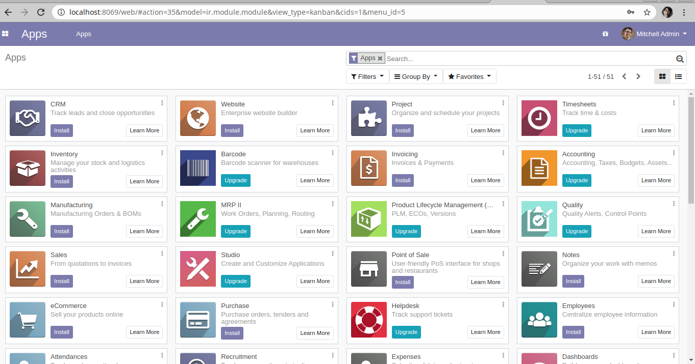
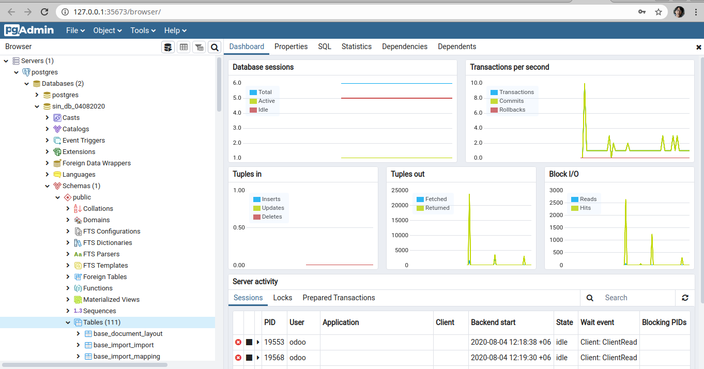

# Installing Odoo 13 on Ubuntu 18.04

Settings > Softwares and Updates > Ubuntu Software: Download From: Server for United States
```
$ sudo apt-get update
```

Run "Software Updater"
```
$ sudo apt-get install git
```

User creation:
```
$ apt-get update && apt-get upgrade # Install system updates
$ apt-get install sudo # Make sure 'sudo' is installed
```

The next set of commands will create an odoo user:
```
$ sudo useradd -m -g sudo -s /bin/bash odoo # Create an 'odoo' user with sudo powers
$ sudo passwd odoo # Ask and set a password for the new user
```

Now we can log in as the new user and set up Odoo.
```
$ whoami
odoo
$ echo $HOME
/home/odoo
```

Install PostgreSQL Server
```
$ sudo apt-get install postgresql -y
```

Create Database user for Odoo
```
$ sudo su postgres
$ cd
$ createuser -s odoo
$ exit
$
$ sudo -u postgres psql
```

Show roles and databases in PostgreSQL
```
postgres=# SELECT rolname FROM pg_roles;
postgres=# \l
```

Change postgres user default password
```
postgres=# \password
Enter new password: postgres
Enter it again: postgres
postgres=#
```

Install Git , Pip , Node.js , and the tools required to build Odoo dependencies:
```
$ sudo apt install git python3-pip build-essential wget python3-dev python3-venv python3-wheel libxslt-dev libzip-dev libldap2-dev libsasl2-dev python3-setuptools node-less
```

Download the package using the following wget command:
```
$ wget https://github.com/wkhtmltopdf/wkhtmltopdf/releases/download/0.12.5/wkhtmltox_0.12.5-1.bionic_amd64.deb
```

Once the download is complete, install the package by typing:
```
$ sudo chmod +x wkhtmltox_0.12.5-1.bionic_amd64.deb
$ sudo apt install ./wkhtmltox_0.12.5-1.bionic_amd64.deb
```

Download Odoo 13 from GitHub
```
$ mkdir ~/odoo-dev # Create a directory to work in
$ cd ~/odoo-dev # Go into our work directory
$ git clone https://www.github.com/odoo/odoo --depth 1 --branch 13.0

```

Create Odoo Log File
```
$ sudo mkdir /var/log/odoo
$ sudo chown -R odoo:root /var/log/odoo
```

Installing virtualenv
```
$ pip install virtualenv
$ which python3
/usr/bin/python3
$ virtualenv -p /usr/bin/python3 py3env
$ source py3env/bin/activate
(py3env) $ 
```

Install all required Python modules with pip3:
```
$ pip3 install wheel
$ pip3 install -r odoo/requirements.txt
```

Create a configuration file with the following content:
```
$ sudo nano /etc/odoo.conf
```

```
[options]

; This is the password that allows database operations:

admin_passwd = admin

db_host = False

db_port = False

db_user = odoo

db_password = False

logfile = /var/log/odoo/odoo-server.log

addons_path = /home/odoo/odoo-dev/odoo/addons,/home/odoo/odoo-dev/odoo/addons
```

Save and Exit the file. Now run the below command on terminal to grant ownership.
```
$ sudo chown odoo: /etc/odoo.conf
```

Now Start Odoo Server
```
$ cd ~/odoo-dev/odoo
$ ./odoo-bin
```
or,
```
$ ~/odoo-dev/odoo/odoo-bin
```

Go to web browser to access Odoo 13

http://localhost:8069

Now create database with necessary information



**Installing Pgadmin4**

Install the public key for the repository (if not done previously):
```
$ curl https://www.pgadmin.org/static/packages_pgadmin_org.pub | sudo apt-key add
```

Create the repository configuration file:
```
$ sudo sh -c 'echo "deb https://ftp.postgresql.org/pub/pgadmin/pgadmin4/apt/$(lsb_release -cs) pgadmin4 main" > /etc/apt/sources.list.d/pgadmin4.list && apt update'
```

Install for both desktop
```
$ sudo apt install pgadmin4
```

Install for desktop mode only:
```
$ sudo apt install pgadmin4-desktop
```

Now run PgAdmin 4 from explorer



Install Modules:

```
- Indian - Accounting
- Inventory
- Sales
- Sales Expense
- Purchase
- Calendar
- Employees
- Attendances
- Employee Contracts
- Time Off 
- Dashboards
- Contacts
- Odoo 13 Full Accounting Kit (https://apps.openerp.com/apps/modules/13.0/base_accounting_kit/)
```

Odoo App Stores
1. https://apps.openerp.com/apps
2. https://odoo-community.org/
